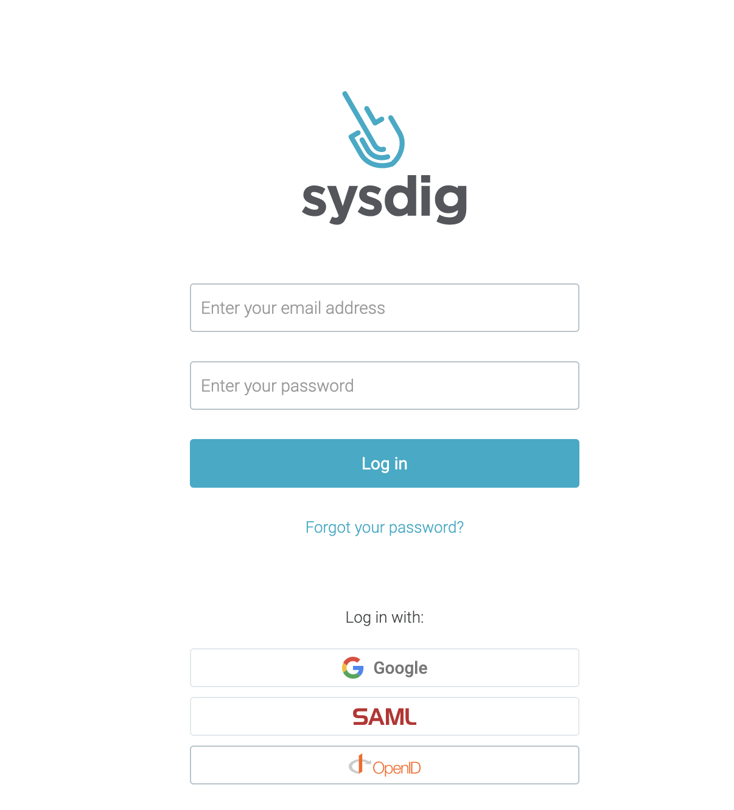
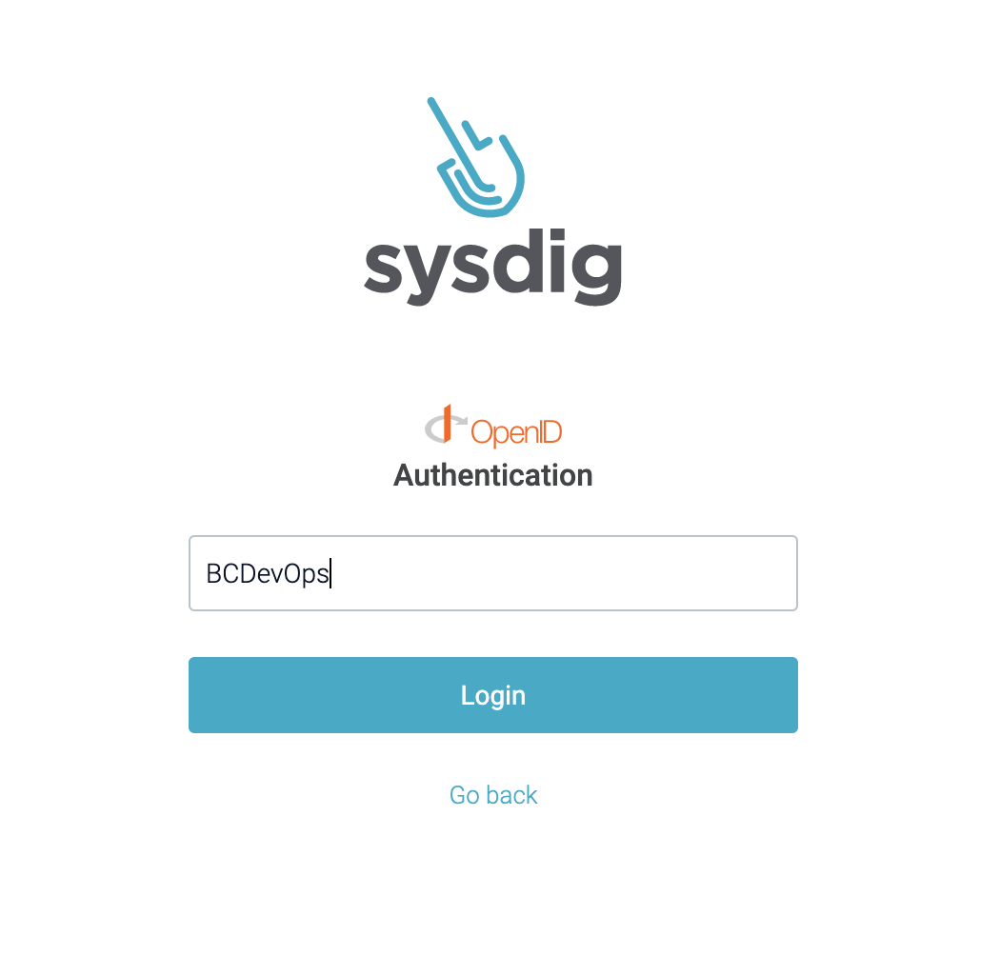

## Sysdig

SSO can utilize Sysdig to benefit daily operation and monitoring of the dev/test/prod services. Access to sysdig is managed through CRD's. To create a sysdig team run `oc apply -f team.yaml` found in `openshift/sysdig` in your __tools__ namespace. 

## Logging In

1. go to https://app.sysdigcloud.com/#/explore/overview/l:3600

2. Login via Openid 

3. Enter in the correct openid alias

4. From there you can navigate to your dashboards or create new ones. You will need to bind permissions to the sysdig team name `6d70e7-team` to grant access. 